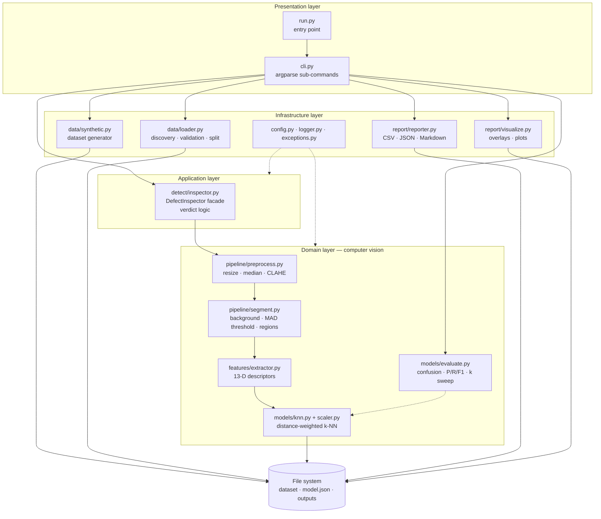
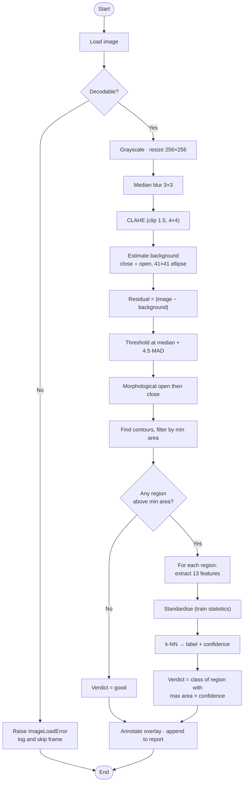
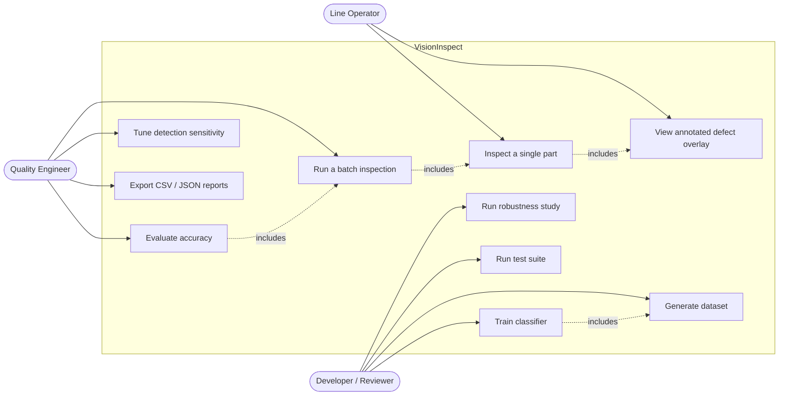
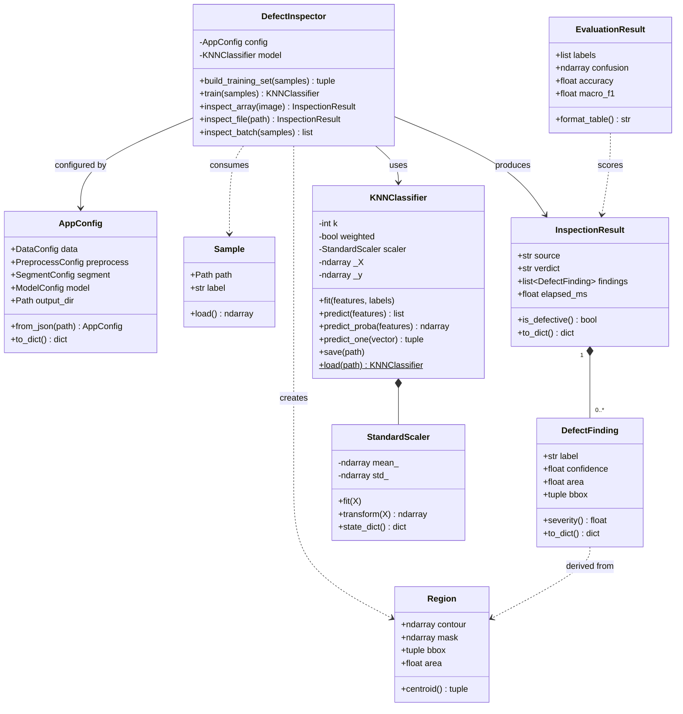
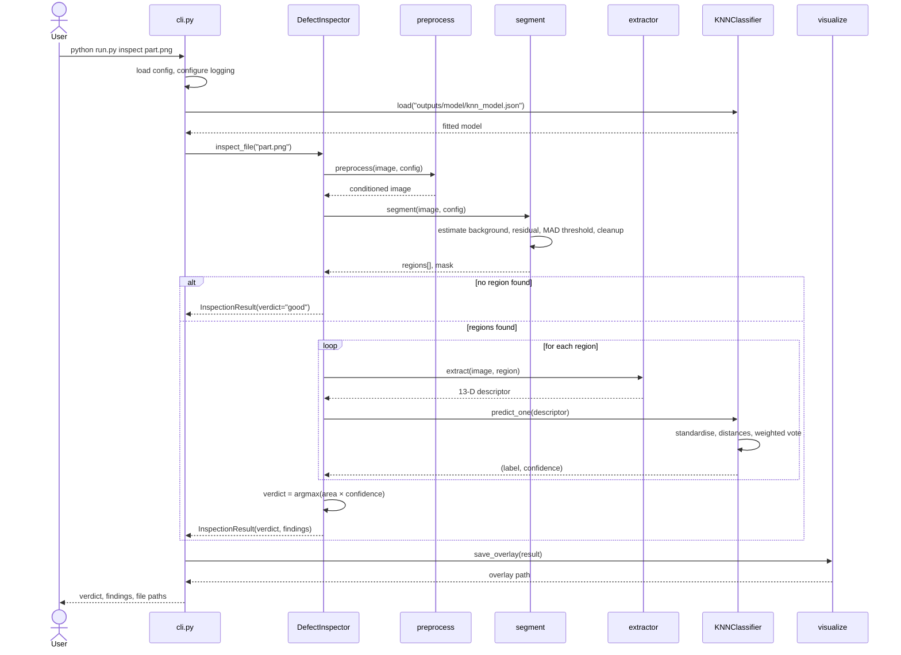
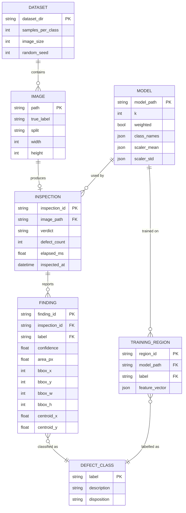

# VisionInspect — Design Document

All diagrams below are Mermaid and render directly on GitHub. Rendered PNG
copies used in the PDF report live in `docs/diagrams/`.

---

## 1. Requirements

### 1.1 Functional requirements

The system is organised into three major functional modules.

#### M1 — Data & Preprocessing

| ID | Requirement |
| --- | --- |
| FR-1.1 | Generate a class-balanced synthetic dataset (`good`, `scratch`, `spot`, `crack`) from a fixed seed. |
| FR-1.2 | Discover and validate images in a folder-per-class layout, rejecting unsupported or undecodable files with a typed error. |
| FR-1.3 | Split the dataset into train/test partitions stratified by class. |
| FR-1.4 | Condition every image: convert to grayscale, resize to a fixed working resolution, denoise, and equalise local contrast. |

#### M2 — Detection & Classification

| ID | Requirement |
| --- | --- |
| FR-2.1 | Estimate the defect-free surface from the image itself, with no golden reference. |
| FR-2.2 | Threshold the residual against a robust noise model and produce a cleaned binary defect mask. |
| FR-2.3 | Extract area-filtered candidate regions, ordered by area, with bounding box and centroid. |
| FR-2.4 | Compute a fixed-length descriptor per region (shape, photometric, Hu moments). |
| FR-2.5 | Train a k-NN classifier on region descriptors and persist it to disk. |
| FR-2.6 | Classify each region with a confidence value and derive a per-image verdict. |

#### M3 — Analytics & Reporting

| ID | Requirement |
| --- | --- |
| FR-3.1 | Compute confusion matrix, accuracy, and per-class precision/recall/F1. |
| FR-3.2 | Sweep the hyper-parameter `k` and report validation accuracy per value. |
| FR-3.3 | Render annotated overlays and three-panel pipeline figures. |
| FR-3.4 | Write CSV, JSON and Markdown reports including batch yield and latency. |
| FR-3.5 | Measure accuracy under controlled image degradation. |

#### Input / output contract

| | Input | Output |
| --- | --- | --- |
| `generate` | samples per class, image size, seed | PNG dataset on disk |
| `train` | dataset directory | `knn_model.json` |
| `inspect` | one image file | verdict, findings, annotated overlay |
| `evaluate` | dataset + model | metrics, CSV/JSON/MD reports, figures |

### 1.2 Non-functional requirements

| ID | Category | Requirement | How it is met | Verified by |
| --- | --- | --- | --- | --- |
| NFR-1 | **Performance** | Inspect an image in under 250 ms on a single CPU core | Fixed 256×256 working resolution; vectorised NumPy distance computation instead of per-sample Python loops | Measured **6.0 ms** average; `test_latency_budget` |
| NFR-2 | **Reliability** | A corrupt or unreadable frame must not abort a batch; no silent failures | Typed exception hierarchy; per-image try/except in `inspect_batch`; every config value validated at construction | `test_corrupt_file_is_skipped_not_fatal`, `test_config.py` |
| NFR-3 | **Usability** | A new user runs the whole project with one command and no data download | `python run.py pipeline`; synthetic generator; `--help` on every sub-command | README quick start |
| NFR-4 | **Maintainability** | Stages must be independently testable and replaceable | Layered package; each stage a pure function of `(input, config)`; 63 tests; docstrings throughout | Module structure; test suite |
| NFR-5 | **Reproducibility** | Identical results across runs and machines | Every random source seeded (`default_rng`); deterministic split; config serialised into the JSON report | `test_preprocess_is_deterministic` |
| NFR-6 | **Observability** | Every stage traceable when something goes wrong | Central `logging` config; `--log-level DEBUG`; logs mirrored to `outputs/logs/` | `logger.py` |
| NFR-7 | **Resource efficiency** | Run on commodity hardware with no GPU | Classical CV + k-NN; peak memory a few MB per image; no model weights to download | Runs on CPU only |
| NFR-8 | **Configurability** | Operators tune sensitivity without editing code | JSON config override; `segment.sensitivity` knob | `test_from_json_applies_overrides` |

---

## 2. System architecture



**Layering rule:** dependencies point downward only. The domain layer knows
nothing about the CLI or the file system, which is what makes each stage
unit-testable in isolation and replaceable (e.g. swapping k-NN for an SVM
touches one module).

---

## 3. Process flow / workflow



---

## 4. Use case diagram



---

## 5. Class / component diagram



---

## 6. Sequence diagram — single inspection



---

## 7. Data / storage design

The project uses a structured **file-system store** rather than a relational
database: inspection records are write-once, append-only and consumed as whole
batches, so a DBMS would add a dependency without adding value. The logical
entity model is nevertheless normalised, and the ER diagram below is the schema
a production deployment would create when persisting to SQL.



**Physical layout**

```
data/dataset/<label>/<label>_NNNN.png     # IMAGE
outputs/model/knn_model.json              # MODEL + TRAINING_REGION
outputs/inspection_report.json            # INSPECTION + FINDING (nested)
outputs/inspection_report.csv             # INSPECTION (flat, for spreadsheets)
```

---

## 8. Design decisions and rationale

| # | Decision | Alternatives considered | Why this one |
| --- | --- | --- | --- |
| D1 | **Classical CV instead of a CNN** | Fine-tuned ResNet, autoencoder anomaly detection | A CNN needs thousands of labelled defects and a GPU, and its failures are opaque. This pipeline trains on ~100 regions in milliseconds and every decision traces to a nameable property. |
| D2 | **Estimate the background instead of using a golden image** | Store one reference image per product and subtract | Golden-image differencing needs pixel-accurate registration and breaks whenever the product, fixture or lamp changes. Morphological reconstruction adapts per frame. |
| D3 | **MAD threshold instead of Otsu** | Otsu, fixed threshold, adaptive Gaussian | This was found empirically: Otsu always splits the histogram in two, so on a defect-free part it manufactures a defect class out of sensor noise — the first implementation produced 8 phantom regions on every clean image and 35% accuracy. MAD estimates the noise floor from the median, which the defect's outlier pixels cannot shift. Accuracy went 35% → 93%. |
| D4 | **CLAHE clip 1.5 with 4×4 tiles** | clip 2.5 with 8×8 tiles (first attempt) | 8×8 tiles are 32 px wide — comparable to a spot's diameter — so CLAHE locally normalised spots *away*, costing 25% of spot recall. Larger tiles with a gentler clip preserve blob contrast. Accuracy 93% → 100%. |
| D5 | **Median blur, not Gaussian** | Gaussian, bilateral | A 5×5 median erased 1–2 px scratches entirely. A 3×3 median removes impulse noise while keeping thin linear structures. |
| D6 | **Interpretable hand-crafted features** | Raw pixels, HOG, LBP histograms | Thirteen named features make classifier errors debuggable, and three of them are asserted directly in the test suite (scratches *are* more elongated than spots). |
| D7 | **k-NN written from scratch** | scikit-learn `KNeighborsClassifier`, SVM | The course goal is understanding the algorithm. Writing it also forced explicit choices about distance weighting and tie-breaking, and keeps the dependency list to three packages. |
| D8 | **Discard regions found in `good` images at training time** | Train a fourth "good region" class | Residual texture in a clean image is not a defect morphology; making it a class blurs the boundary. Clean parts are handled by the structural rule "no region above minimum area → good", which measured 0 false positives. |
| D9 | **Severity = area × confidence for the verdict** | Largest region; highest confidence; majority vote | Area alone lets a big faint smudge outrank a small certain crack; confidence alone lets a 3-pixel speck decide. The product balances both. |
| D10 | **Frozen dataclass config** | Dict, YAML, module constants | Invalid values fail at construction with a clear `ConfigError` instead of surfacing as a confusing OpenCV assertion deep inside the pipeline. |
| D11 | **Synthetic dataset generator** | Download NEU-DET / DAGM / MVTec-AD | Makes the repository self-contained, reproducible from a seed, and free of licensing constraints — at the acknowledged cost of realism (see §9). |
| D12 | **JSON model persistence** | Pickle, joblib, NPZ | Pickle is unsafe to load from an untrusted source and is version-fragile. JSON is inspectable in a text editor and portable across Python versions. |

---

## 9. Known limitations

1. **Synthetic data.** Defects are drawn by known generators, so classes are
   cleanly separable — hence the flat k-sweep and the 100% score. Real parts
   carry overlapping defects, machining marks and oblique lighting.
2. **One dominant defect per training image.** The training set labels only the
   largest region per image, so genuinely multi-defect parts are not modelled
   at training time (they are still handled at inference).
3. **k-NN stores the entire training set.** Memory and inference cost grow
   linearly with training size; at production scale this needs a KD-tree or a
   parametric model.
4. **Planar, single-camera, grayscale only.** No 3-D, colour or specular
   handling.
5. **Sensor noise is the weak point.** Accuracy falls to 0.73 at σ = 25, since
   heavy noise raises the MAD floor above faint defects.

## 10. Future enhancements

- Replace the k-NN with a small SVM or random forest and compare on the same descriptors.
- Add a KD-tree index so inference cost stops scaling with training-set size.
- Train and benchmark on a real dataset (NEU-DET) to quantify the synthetic-to-real gap.
- Add multi-defect verdicts that report every finding rather than one dominant class.
- Wrap the inspector in a REST service and stream frames from a live camera.
- Track defect-rate trends over time and raise a control-chart alarm when a class rises.
